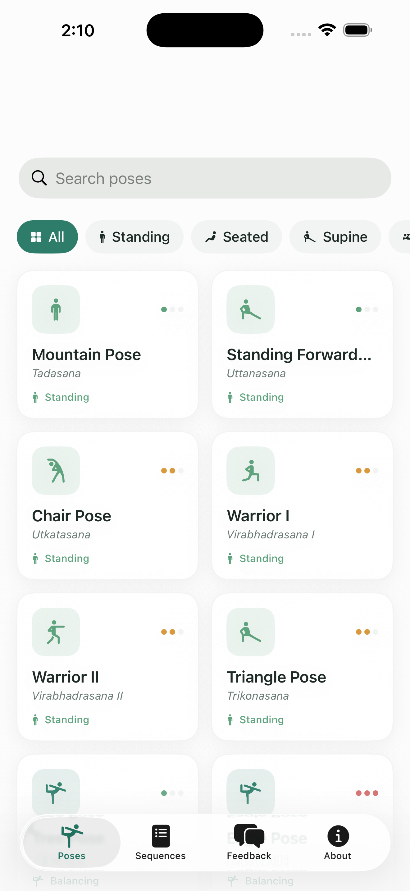

# ZenAsana 🧘

A calm, native **iOS yoga practice app** built with SwiftUI. Browse essential yoga
poses with animated figures and stance guidance, then flow through popular timed
sequences with a guided session player — all in a clean, distraction-free white theme.

<a href="https://apps.apple.com/us/app/zenasana/id6782540959">
  
</a>

📲 **[Download ZenAsana on the App Store](https://apps.apple.com/us/app/zenasana/id6782540959)**



## Features

- **24 essential poses** — common + Sanskrit names, animated SF Symbol figures, difficulty
  level, step-by-step instructions and benefits.
- **Stance states** — every pose is tagged by its relationship to the ground: Standing,
  Seated, Supine, Prone, Kneeling, Balancing, Inversion, Restorative — with filter chips and search.
- **6 popular sequences** — Sun Salutation A, Morning Wake-Up, Power & Strength, Balance &
  Focus, Evening Wind-Down, Hip Opener — each with per-pose timing and total duration.
- **Guided session player** — full-screen countdown ring, breathing animation, "next pose"
  preview, and play / pause / skip controls.
- **Feedback & About** — in-app feedback via WhatsApp and an About screen with developer info.
- **Universal** — adaptive layouts for iPhone and iPad, light/white theme throughout.

## Tech Stack


- **SwiftUI** (iOS 17+), `NavigationStack`, `TabView`, SF Symbols
- **XcodeGen** — the Xcode project is generated from [`project.yml`](project.yml)
- Single-file theme tokens in [`Sources/Theme.swift`](Sources/Theme.swift)
- No backend, no account, no tracking — all content is bundled and works fully offline

## Project Structure

```
Sources/
  YogaApp.swift          App entry + white-theme appearance
  Theme.swift            Brand color tokens + card surface modifier
  Models/Yoga.swift      Poses, sequences, stance states (the content library)
  Views/                 MainTabView, Poses, PoseDetail, Sequences, SessionPlayer,
                         Feedback, About, PoseFigure (animated)
Resources/
  Assets.xcassets        App icon (lotus), accent + launch colors
project.yml              XcodeGen project definition
```

## Getting Started

```bash
# Requires Xcode 16+ and XcodeGen (brew install xcodegen)
xcodegen generate
open ZenAsana.xcodeproj
# Select an iPhone simulator and Run (⌘R)
```

Or build & run from the command line:

```bash
xcodebuild -project ZenAsana.xcodeproj -scheme ZenAsana \
  -sdk iphonesimulator -destination 'platform=iOS Simulator,name=iPhone 17 Pro' build
```

## Acknowledgements

Pose names and guidance follow widely taught Hatha/Vinyasa yoga conventions. This app is
for general wellness and education — practice within your limits and consult a professional
if you have any injury or medical condition.

---

Developed by **Tertiary Infotech Academy Pte Ltd** · [tertiaryinfotech.com](https://www.tertiaryinfotech.com)
